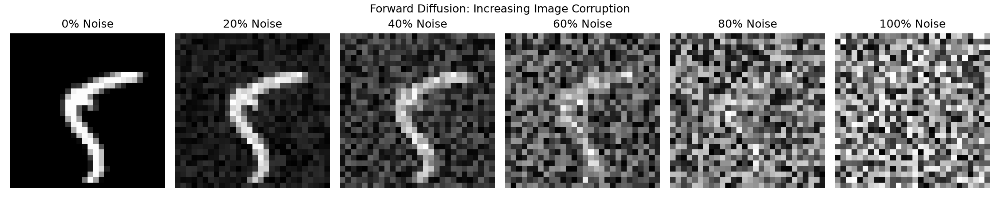
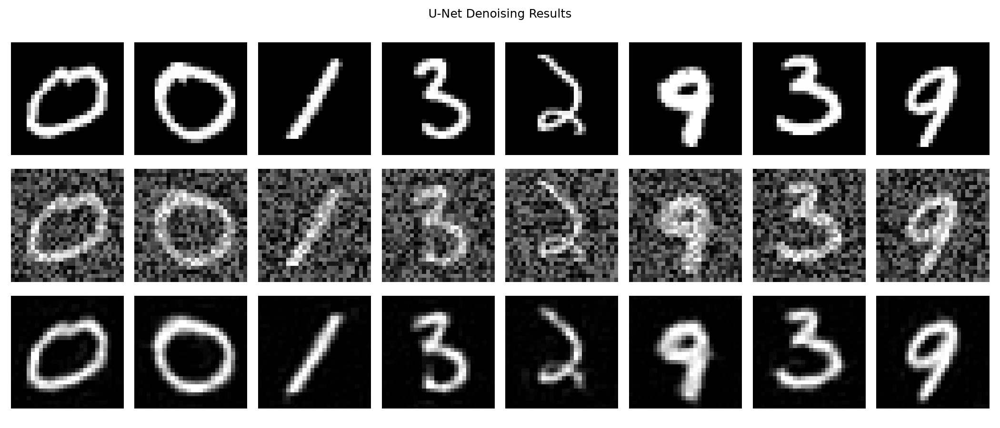
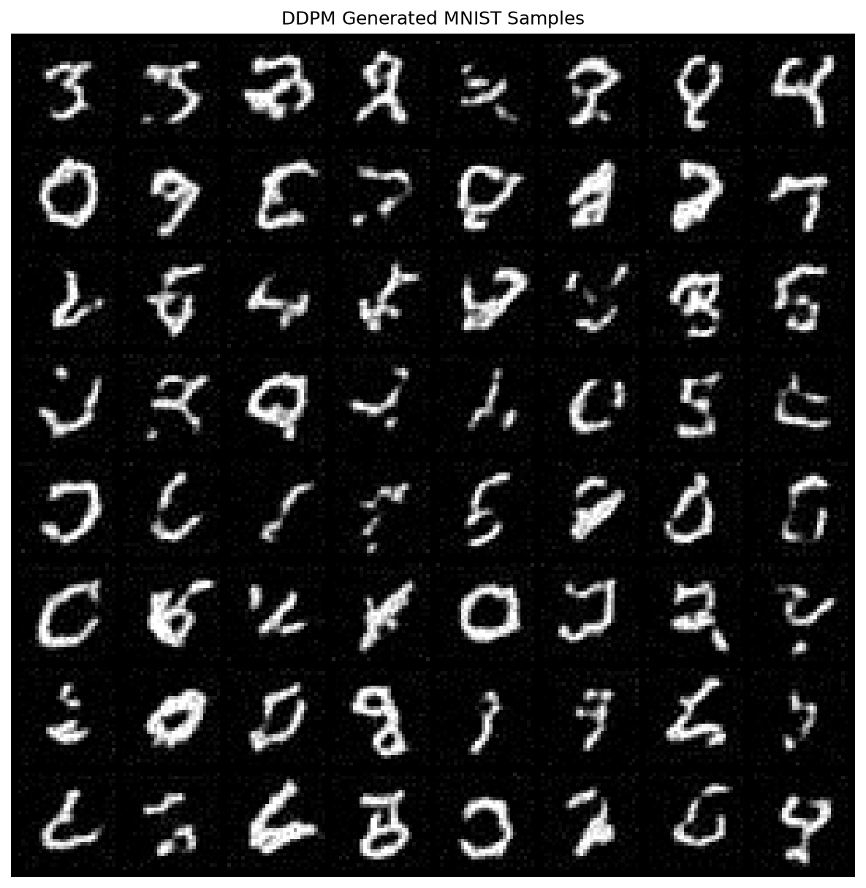

# DiffusionLab — DDPM From Scratch in PyTorch

A from-scratch implementation of a Denoising Diffusion Probabilistic Model (DDPM) in PyTorch.

This project explores the core ideas behind diffusion models by progressively building:

- MNIST data pipeline
- Forward image corruption
- Gaussian noise scheduling
- U-Net denoising architecture
- Sinusoidal timestep embeddings
- Noise prediction training objective
- Reverse diffusion sampling
- Automated tests
- Visualization of generated samples

## Results

### Forward Diffusion



### Denoising Results



### DDPM Generated Samples



## Architecture

The model learns to reverse a gradual noising process.

Clean Image  
↓  
Add Gaussian Noise at timestep `t`  
↓  
Noisy Image `x_t`  
↓  
Time-Conditioned U-Net  
↓  
Predict Noise `ε`  
↓  
Reverse Diffusion  
↓  
Generated Image

## Project Structure

```text
DiffusionLab-DDPM-From-Scratch-in-PyTorch/
│
├── src/
│   ├── data.py
│   ├── noise.py
│   ├── visualize_noise.py
│   ├── unet.py
│   ├── train.py
│   ├── evaluate.py
│   ├── sample.py
│   ├── ddpm_scheduler.py
│   ├── train_ddpm.py
│   └── sample_ddpm.py
│
├── tests/
│   ├── test_noise.py
│   ├── test_unet.py
│   └── test_ddpm_scheduler.py
│
├── outputs/
├── notebooks/
├── requirements.txt
├── pytest.ini
└── README.md